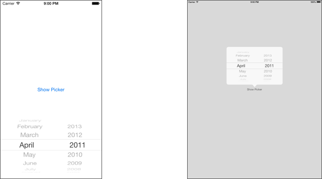

# NTMonthYearPicker

NTMonthYearPicker is a simple month / year picker component for use in iOS applications.

## Installation

- Clone or download the repository
- Drag the `NTMonthYearPicker/NTMonthYearPicker` folder into your project.

## Usage

Usage is identical to that of UIDatePicker. In fact, NTMonthYearPicker's public interface exactly mimics that of UIDatePicker.

To use NTMonthYearPicker in Interface Builder, drag a View component from the Object library into your view, then change the view's class from `UIView` to `NTMonthYearPicker`.

To see how to create a NTMonthYearPicker instance at runtime, check out the included demo iOS application `NTMonthYearPickerDemo` that shows you how to do this for both iPhone and iPad.

## Notes

I created this component because the standard iOS UIDatePicker component only allows you to specify full dates i.e. day, month and year, but I had a use case in which the user needed to specify only the month and the year, or only the year.

I found a few other 3rd party iOS month/year picker implementations, but they either did not support many core properties of UIDatePicker such as `minimumDate` and `maximumDate`, or extended UIPickerView instead of UIControl, which meant that they would not emit `UIControlEventValueChanged` events like a `UIDatePicker`.

NTMonthYearPicker extends UIControl, exactly like UIDatePicker does, and re-implements all relevant functionality. I would have liked to simply extend the UIDatePicker class, but I don't know if this is possible. If it is, please let me know so I can rework this component.

## Credits

NTMonthYearPicker was created by [Arun Nair](http://nairteashop.org). If you use this code in your project, attribution is appreciated.
